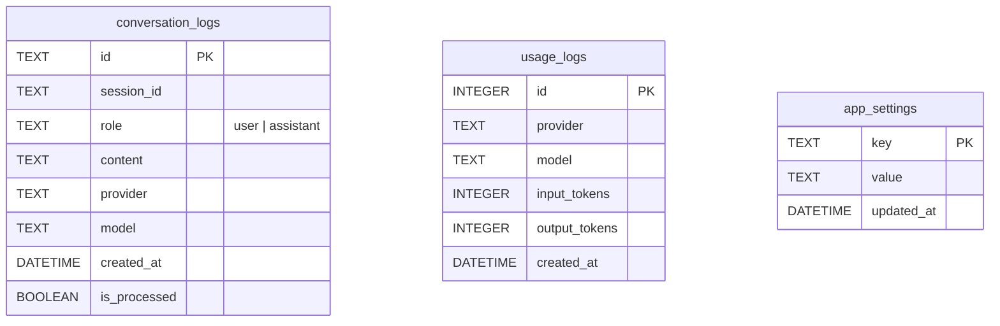

# 保存データと設定

## 保存場所

すべてアプリデータディレクトリ(識別子 `MyAssistant`)に保存され、リポジトリには含まれない。macOS では `~/Library/Application Support/MyAssistant/`。

下の表の `timeline.db`・`secrets.json`・ナレッジは**ワークスペースごと**に持つ。パーソナルは下記のとおりアプリデータ直下、ワークのスペースは `workspaces/<UUID>/` 配下に同じ構成で置く([workspace.md](workspace.md))。`models/`・`voice/`・`voicevox/` は端末で共有する。

| パス | 内容 |
| --- | --- |
| `timeline.db` | SQLite。会話ログ・使用量・アプリ設定 |
| `secrets.json` | API キー。**平文 JSON**(権限 0600)。OS のキーチェーンは使っていない([security.md](security.md)) |
| `models/` | Whisper モデル(`ggml-large-v3-turbo-q5_0.bin` / `ggml-small.bin`) |
| `voice/` | 定型音声(`<id>-<ハッシュ>.mp3` / `.wav`。声ごとに別ファイル) |
| `voicevox/` | VOICEVOX CORE・ONNX Runtime・OpenJTalk 辞書・音声モデル(設定画面から取得) |
| ナレッジ | 既定ではアプリデータ配下(`knowledge/`)。設定で任意のフォルダへ変更できる([knowledge.md](knowledge.md)) |
| `tts_dictionary.json` | 読み上げ辞書(ユーザー登録分) |
| `workspaces/registry.json` | ワークのスペース一覧(id・名称・イメージカラー・作成日時) |
| `workspaces/<UUID>/` | スペースのデータ。`timeline.db`・`secrets.json`・`knowledge/`・`tts_dictionary.json` をパーソナルと同じ名前で持つ |

旧名(識別子 `dev.longin.tachicoma-agent`)のフォルダがあり新しいフォルダが無ければ、起動時に丸ごと改名して引き継ぐ(`services/legacy_data.rs`)。ナレッジ内の旧 `.tachicoma/` もコマンド権限の読み書き時に `.my-assistant/` へ改名する。旧名の設定ファイルも取り込める。

## SQLite スキーマ(`db/mod.rs`)


```mermaid
erDiagram
  conversation_logs {
    TEXT id PK
    TEXT session_id
    TEXT role "user | assistant"
    TEXT content
    TEXT provider
    TEXT model
    DATETIME created_at
    BOOLEAN is_processed
  }
  usage_logs {
    INTEGER id PK
    TEXT provider
    TEXT model
    INTEGER input_tokens
    INTEGER output_tokens
    DATETIME created_at
  }
  app_settings {
    TEXT key PK
    TEXT value
    DATETIME updated_at
  }
```

| テーブル | 役割 | 主な操作 |
| --- | --- | --- |
| `conversation_logs` | 会話の一次ログ(時系列)。インデックスは `(session_id, created_at)` と `is_processed` | 保存、直近 N 件・全件の取得、未処理の取得、処理済みにする |
| `usage_logs` | LLM 呼び出しごとのトークン使用量 | 記録、当月(ローカル時間)のプロバイダー・モデル別集計 |
| `app_settings` | キー・値の設定(値は文字列。構造のあるものは JSON) | 取得、upsert |

- `conversation_logs.is_processed`: 整理バッチがナレッジへ反映したかどうか([knowledge.md](knowledge.md))。
- 接続は `Mutex<Connection>`。ロックが毒されても(パニック後)中身を使い続ける。

## 設定項目(`app_settings`)

| キー | 値 | 既定 | 設定画面 |
| --- | --- | --- | --- |
| `routing` | `Route`(JSON) | Claude が使えれば Sonnet | 対話画面のモデル選択 |
| `web_access` | `0` / `1` | 有効 | Web Search |
| `shell_access` | `0` / `1` | 有効 | Command Tasks |
| `stt_engine` | `local` / `google` / `aqua` | `local` | Voice Link |
| `stt_language` | `auto` / `ja` / `en` / `zh` / `ko` | `auto` | Voice Link |
| `tts_engine` | `google` / `voicevox` | `google` | Voice Link |
| `voicevox_style` | VOICEVOX のスタイル ID(数値の文字列) | `3`(ずんだもん ノーマル) | Voice Link |
| `whisper_revision` | Hugging Face のリビジョン(ブランチ・タグ・コミット) | `main` | Voice Link(取得バージョン) |
| `voicevox_versions` | 取得する配布物のバージョン(JSON: `core` / `onnxruntime` / `models` / `dict_release` / `dict`。未指定の項目は既定値) | CORE `0.17.1`、ONNX Runtime `1.23.2`、音声モデル `0.17.0`、辞書 `v1.11.1` / `1.11` | Voice Link(取得バージョン) |
| `tuning` | 上限の調整項目(JSON) | 下表 | Limits |
| `batch_route` | `Route`(JSON) | 既定 | ナレッジ画面 |
| `debug_mode` | `0` / `1` | 無効 | Debug Mode |
| `space_data` | スペースデータ(JSON `{enabled, text}`。スペースのみ。コピー・エクスポートの対象外) | 有効・空 | Space Data |
| `knowledge_dir` | 絶対パス(空なら既定) | 既定 | ナレッジ画面 |
| `summary:<session_id>` | 会話の要約(JSON) | — | — |

**全体設定に移した項目**(ベースプロンプト `base_instructions`、OS通知、表示言語、校正 `proofread_route`、音声入力の待ち時間 `voice_timing`、起動ワード `wake_enabled` / `wake_words`、パーソナルデータ `user_profile`、ナレッジ整理の間隔 `batch_interval_minutes`)は、`app_settings` ではなく `workspaces/global_settings.json` に保存する。スペースのDBに残った同名の値は読まない([global-settings.md](global-settings.md))。

自動保存: 調整項目と Command Policy は、入力欄を離れたときに保存する。

## 調整項目(`tuning.rs`)

スペースごとの上限(`tuning`)と、全体設定の音声入力の待ち時間(`voice_timing`)に分かれる。

数値は保存時に範囲内へ丸める。未保存・欠けた項目は既定値。非数は下限になる。

| 項目 | 意味 | 範囲 | 既定 |
| --- | --- | --- | --- |
| `web_search_max` | 1 回の依頼で行うインターネット検索の上限回数 | 1〜20 | 5 |
| `web_fetch_max` | 1 回の依頼で行うページ取得の上限回数 | 1〜20 | 5 |
| `voice_idle_secs` | 声が入らなければ音声入力を終える時間(秒) | 1.0〜30.0 | 3.0 |
| `utterance_silence_secs` | 話し終わりとみなす無音の長さ(秒) | 0.5〜5.0 | 1.2 |
| `release_tail_secs` | スペースを離してから録音を止めるまでの猶予(秒) | 0.0〜3.0 | 0.5 |
| `history_exchanges` | 過去の会話をそのまま LLM へ渡す往復数の上限。超えた分は要約 | 2〜30 | 10 |

## 使用量の表示

- `usage_logs` を当月(ローカル時間)で集計し、プロバイダー・モデル別に表示する(`UsageHud`)。
- 金額は `src/lib/pricing.ts` の単価(100 万トークンあたり、USD)からの**概算**で、請求額とは一致しない場合がある。単価が未登録のモデルは金額を出さない。
- このアプリ経由の呼び出しだけのローカル集計。Web 検索の追加料金や、Google Cloud・Aqua Voice の利用料は含まない。

## 設定のエクスポート・インポート(`settings_transfer.rs`)

別の端末への移行やバックアップに使う。設定画面の Backup。

### 対象

- `app_settings` のうち上表の**設定項目**(`routing` から `knowledge_dir` の手前まで。全体設定の項目は含まない)と、**コマンド権限**(`command-policy.json`)。
- **含まない**: API キー、スペースデータ(`space_data`)、端末ごとに異なるナレッジの保存先(`knowledge_dir`)、会話ごとの要約、会話の履歴。
- 全体設定の項目(ベースプロンプト・パーソナルデータ・起動ワード・校正・音声入力の待ち時間・ナレッジ整理の間隔・表示言語・OS通知)は含まない。全体設定には別のエクスポート/インポートがある([global-settings.md](global-settings.md))。
- 書き出し・取り込みの対象は、選択中のワークスペースの設定。ワークスペース間で設定を写すには、`/workspace` の設定のコピーを使う([workspace.md](workspace.md))。

### ファイル

```json
{
  "app": "MyAssistant",
  "version": 1,
  "exported_at": "2026-10-29T03:00:00Z",
  "settings": { "routing": "{...}", "shell_access": "1" },
  "command_policy": { "version": 3, "allow": [] }
}
```

- 保存先は、ダイアログで選んだ拡張子 `.json` の絶対パスのみ。既定のファイル名は `myassistant-settings-<日時>.json`。
- 未設定の項目は書き出さない。

### 取り込み

1. 1,000,000 バイトを超えるファイルは拒否する。
2. `app` と `version` を確認する(別アプリのファイル・未対応の版は拒否)。
3. **全項目を検証してから書き込む**。型ごとに検証する: フラグ(`0` / `1`)、JSON として読めるか、許可された値のどれか、文字列(20,000 文字以内)、パーソナルデータ(通常の入力と同じ検証)。**不正な項目が 1 つでもあれば何も変更しない**。
4. ファイルに無い項目は変更しない。未知の項目は読み飛ばす(`skipped`)。
5. コマンド権限は検証(`cleaned`)して保存する。デバッグモードの出力先を決め直す。

結果は `{ applied, skipped }` で返す。
